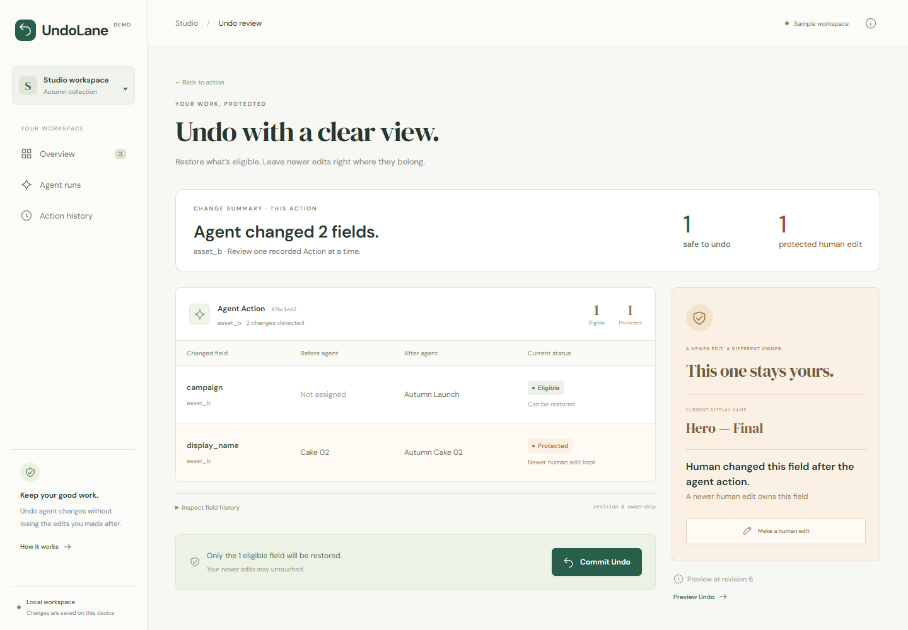

# UndoLane

**Agent mistake removed. Human work preserved.**

UndoLane is a working local prototype for GIBC V2 Track 03: Open / General Technical Invention. Inspect and selectively undo an agent's recorded changes while preserving later human edits.



## Project overview

A React workspace, a minimal Agent Runner, a real MCP tool server, and a SQLite undo engine form one inspectable workflow. The no-key Demo recipe uses the actual Runner, MCP protocol, and database. A separately labeled Live mode uses your configured OpenAI-compatible model.

## Problem

Agents can apply repetitive changes across content quickly. People keep working after those changes. When an automated update turns out to be unwanted, restoring the old data can also erase the human work that followed.

Our reproducible example is a campaign workspace: the agent changes titles and campaign assignments, then a person perfects one title. The campaign assignment needs to go; the finished title needs to stay.

## Solution

UndoLane presents the exact fields an Action changed, previews which ones are still eligible to undo, and protects fields owned by newer edits. A user reviews the plan before committing a new compensation operation.

**UndoLane is not a snapshot rollback system. It performs ownership-aware selective undo based on recorded effects and revisions.**

## Why existing rollback fails in this scenario

A naive whole-resource before-snapshot restore replaces the newer title with `Cake 02`. A whole-resource version check that rejects everything preserves the title, but leaves the independently reversible campaign change in place. UndoLane restores that campaign while keeping `Hero — Final`.

This comparison describes two simple recovery strategies, not every rollback product. Selective undo, concurrency checks, and compensating transactions are established ideas; we do not claim to have invented them.

## How UndoLane works

1. The agent reads assets and field revisions through MCP.
2. Each successful patch records an **Action** and per-field **Effects**, including before/after values and `previous_effect_id`.
3. A later Human Action changes the field's `active_effect_id` and increments its revision.
4. Preview checks persisted history and current ownership. A matching value alone is insufficient, including when a human edits away and back to the same value.
5. **Eligible** fields can be restored. **Protected** fields retain their current values. The engine reason is `A newer human edit owns this field`; the UI explains, “Human changed this field after the agent action.”
6. Commit reloads the saved plan and validates it against current SQLite state in a transaction. A stale plan produces zero undo writes. Successful undo appends compensation records, preserves original history, and increases revisions. Retrying the same commit returns its saved receipt.

Undo operates on one Action at a time. It does not atomically undo an entire Run. Protection applies during conditional undo, not as a permanent lock against future authorized writes.

## Architecture

```mermaid
flowchart TD
  U[User] --> W[UndoLane Web App]
  W --> H[Local HTTP API]
  H --> R[Agent Runner]
  P[Live provider or labeled Fixture] <--> R
  R --> C[MCP Client]
  C --> S[MCP Server]
  S --> E[Undo Engine]
  E --> D[SQLite Event History and current fields]
  H -->|Human Action| E
  H -->|Preview / Commit| C
  E --- A[Action / Effect / Revision]
  E --- X[Protected Edit retained]
```



[Architecture PNG](docs/architecture.png) · [Editable SVG](docs/architecture.svg)

“Event History” refers to recorded Actions, Effects, and compensation records, not a separate event bus. Web history JSON stores presentation metadata; SQLite remains authoritative for business state. Human edits pass through the Engine. Agent edits and Undo Preview/Commit pass through MCP. No browser or agent receives direct database access.

## Technical innovation

The contribution is an end-to-end, reviewable recovery workflow for interleaved human/agent edits in a managed workspace: field ownership determines eligibility, revisions prevent stale commits, and durable compensation receipts make retries safe. Undo decisions are deterministic; a model never invents inverse values.

This prototype demonstrates a narrower recovery boundary than a whole-object restore. It does not claim universal rollback, new database theory, or measured performance at large scale.

## Demo instructions

Prerequisites: **Node.js 24**, npm, and a local browser. Dependencies are pinned. The project `.npmrc` disables dependency lifecycle scripts: the locked native dependencies include prebuilt binaries. This avoids an unnecessary `node-gyp` rebuild in npm 11 on Windows. Include `.npmrc` when copying the project. Updating native dependencies requires rechecking this installation choice.

```sh
npm ci
npm run dev
```

Open **http://127.0.0.1:5173**. No paid key or account is needed for Demo recipe.

1. Start with `Cake 01`, `Cake 02`, `Cake 03`. The first two assets are approved; campaigns are unassigned.
2. Run **Prepare approved assets for Autumn Launch** in Demo recipe mode.
3. Observe five MCP results: list, two detail reads, and two patches. The Run records **2 Actions / 4 Effects**.
4. In Workspace, edit `asset_b`'s display name to **Hero — Final**.
5. Treat the campaign preparation as unwanted: the launch has been canceled. Open the `asset_b` Action, then Review undo.
6. Preview shows **2 changed fields / 1 safe to undo / 1 protected human edit**.
7. Commit Undo. `asset_b.campaign` returns to null with revision **2**. Its human title stays. The result is **partially_undone**.
8. To undo the remainder of the Run, separately preview and commit `asset_a`'s Action: two eligible fields. Across the two commits, three Agent changes are restored and one Human title is preserved. `asset_c` stays unchanged.

The recipe does not contain an injected selection bug or demonstrate a naturally occurring model mistake. It demonstrates reversing an unwanted batch after a person continues editing. The tiny dataset makes the mechanism visible; no throughput claim is made.

### Repeat from a fresh workspace

Stop the server with Ctrl+C. Use a **new directory name** for each take; reusing an existing one resumes its history.

```powershell
$env:UNDOLANE_WEB_DATA = ".undolane-web/take-02"
npm run dev
```

macOS/Linux: `UNDOLANE_WEB_DATA=.undolane-web/take-02 npm run dev`.

Default data lives in `.undolane-web/workspace.sqlite` and `web-history.json`. Restart preserves completed history; unfinished runs are marked interrupted rather than replayed. Starting a new Agent Run can write fields again, including a previously protected title; use a fresh workspace when recording the same story.

### Optional live model

Copy `.env.example` to the ignored `.env` and set `UNDOLANE_API_KEY`, `UNDOLANE_BASE_URL`, and `UNDOLANE_MODEL` locally. Use a model supporting OpenAI-compatible Chat Completions tool calls, then restart the server and choose Live model. Credentials stay on the server. Live execution was not used for automated verification.

Existing CLI entry points remain: `npm run demo`, `npm run agent -- --db ./workspace.sqlite --task "Prepare approved assets for Autumn Launch"`, and `npm run demo:agent`. Model-backed CLI commands require environment configuration. [MCP contracts](docs/Phase2-MCP.md) · [Agent configuration](docs/Phase3-Agent.md).

## Validation

```sh
npm run typecheck
npm run build
npm test
npm run test:web
```

The browser test requires installed Google Chrome and uses a separate workspace. The suite verifies real MCP and SQLite behavior. Current results: **33 Vitest tests and 1 complete browser scenario pass**, including Human protection, stale-plan refusal, durable retries, restart/reload persistence, and mobile layout. Typecheck and production build pass. See the [readiness report](docs/Competition-Readiness.md) for installation checks and remaining delivery work.

## Tech stack / Built With

TypeScript, Node.js, React, React DOM, Vite, @vitejs/plugin-react, SQLite, better-sqlite3, the official MCP TypeScript client/server SDK, Zod, Vitest, Playwright, and Google Chrome. Self-hosted DM Sans and DM Serif Display use @fontsource packages (font licenses are included in their packages). See `package-lock.json` for exact versions and transitive dependencies. Original SVG asset illustrations use synthetic sample metadata; no external dataset is used.

OpenAI-compatible Chat Completions is the optional model interface; no provider brand is claimed as used in the Fixture recording. OpenAI Codex/ChatGPT assisted implementation, tests, UI, and documentation. The submitter remains responsible for reviewing and explaining the code. Include this assistance in Devpost Built With.

## Future work

Future work includes evaluation with real creative workflows, more granular stale-plan checks, and explicit dependency/derived-artifact tracking. These are not implemented. This submission does not include multi-agent execution, additional databases, cloud deployment, accounts, permissions, or commercial features.

The guarantees apply to supported scalar writes in this managed workspace, where all writes go through the Engine. External SaaS compensation and arbitrary filesystem rollback are out of scope. No user-study results or recovery-time savings are claimed.

[Competition story and video script](docs/Competition-Demo.md) · [Submission screenshots](docs/submission/README.md)
