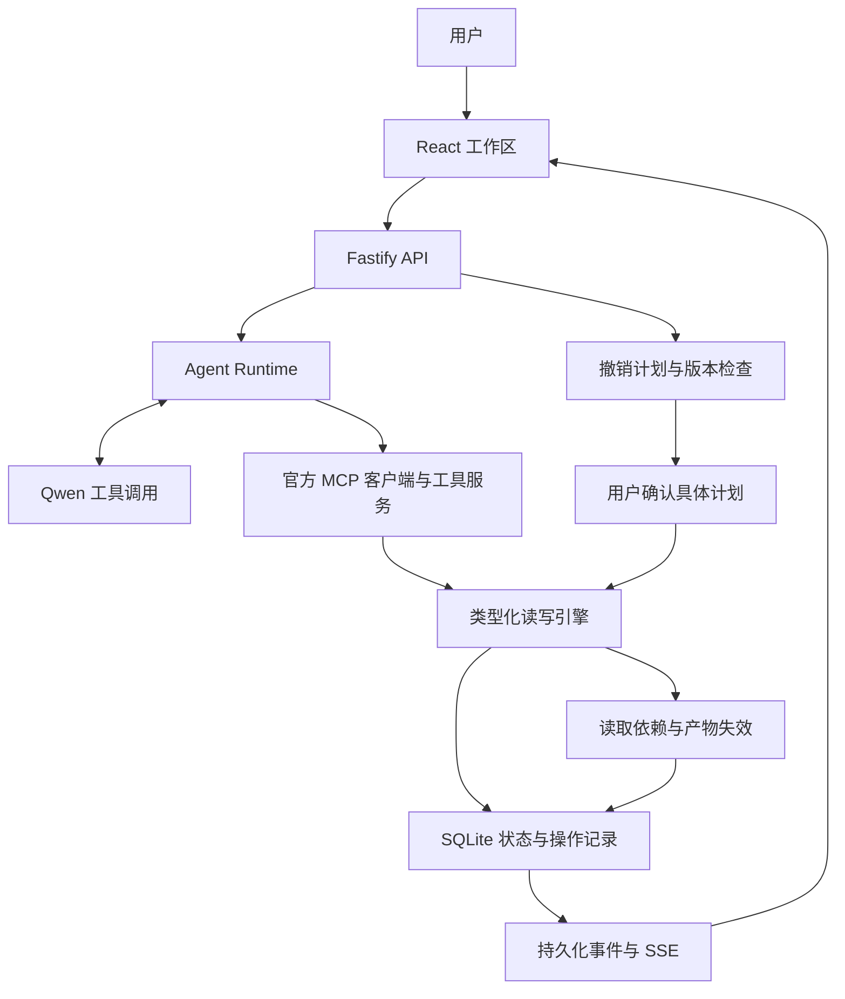

# GIBC V2 Track 03：选题审查与 UndoLane 开发方案

核查日期：2026-09-05。比赛日期按 UTC+8 解读。本文是选题与开发设计，尚未开发、测试或提交产品；所有评分、效果目标和工作量都是规划判断，不是已取得的成绩。项目名称均为工作名，尚未做商标核查。

本文先给出 10 个候选，再完成 Top 5 竞争审查，最后给出明确首选及实施合同。默认个人开发、14 天、每天约 6–7 小时，合计约 80–95 小时。若每天只有两小时，应直接删减到核心引擎和一个演示场景。

## 1. 官方事实与参赛边界

| 核查项 | 当前官方信息 | 对你的实际影响 |
|---|---|---|
| 赛期 | 2026-07-11 至 2026-09-21 | 现在开始的新项目处于赛期内 |
| 截止 | 9 月 21 日 23:45，台北时间 UTC+8；北京时间相同 | 内部提交目标设为 9 月 19 日 |
| 评审、公布 | 9 月 22–27 日评审，9 月 29 日公布 | 提交后继续保持作品和链接可访问 |
| 资格 | 面向学生，13 岁以上；个人或最多 6 人；一人只能在一个提交团队，一队一项目一赛道 | 本方案以你仍具备在读学生资格为前提；“个人开发者”本身不等于符合资格 |
| 地区 | 全球开放，适用 Devpost 通用排除条款 | 赛事规则没有单列排除中国大陆；这不等于保证每个赞助商服务均可使用 |
| Track 03 | 可运行且具有技术新意的原型；软件可以参赛，无架构或资源上限 | 不需要训练模型、硬件或大量 GPU |
| 原创性、AI | 作品须在赛期内开发；不得以旧项目或基本相同的往届作品重复参赛；允许 AI Coding，必须披露 | 新建项目并保留开发记录，说明哪些部分使用了 AI |
| 名次 | 赛道内分数最高依次获得 Gold、Silver、Bronze；同分优先第一项标准 | Track 03 的同分优先项是 Creativity |

来源：[官方 Rules](https://gibc-v2.devpost.com/rules)、[官方 Schedule](https://gibc-v2.devpost.com/details/dates)。

提交材料共六项：英文项目说明；含安装、依赖和运行说明的公开源码仓库；2–5 分钟视频（YouTube、Vimeo 或 Youku，非私密，英文音频或英文字幕）；完整 Built With；已加入项目的队员真实姓名和 Devpost 账户；至少 3 张截图。英文 README 和无付费 Key 的评审体验一并准备。评审基于 Devpost 提交材料，官方没有要求获奖前再进行额外答辩。[官方 Requirements](https://gibc-v2.devpost.com/#challenge-requirements)

官方四项评分含义如下，**没有公开每项权重或具体分值刻度**：

| 官方维度 | 本次核查的含义 | 本方案的响应 |
|---|---|---|
| Creativity | 概念是否原创、敢于突破 | 明确指出“后续人工修改”这一难点 |
| Execution | 技术质量、完成度、可用性 | 真实状态修改、条件撤销、持久化与恢复 |
| Impact | 解决真实问题或产生启发的潜力 | 用修复效率和人工修改保留率证明 |
| Presentation | Demo 是否清晰、有质量，能否表达愿景 | 用同一组素材展示错误、干预和修复 |

来源：[官方 Judging Criteria](https://gibc-v2.devpost.com/#judging-criteria)。后文的 Technical Novelty、Two-week Feasibility、Winning Potential 是选题辅助指标，不是官方新增评分项。

有两处页面差异需要知道：Overview 将 Discord 写成推荐加入，Resources 写成 Required，建议直接加入读取公告；Overview 的奖品清单比 Rules 更长，赞助细项存在不同步。两个页面都明确奖品为非现金权益，不能把首页的美元总额当作现金奖金。本方案不依赖赞助商工具，也不把奖品价值纳入选题评分。[Overview](https://gibc-v2.devpost.com/)、[Resources](https://gibc-v2.devpost.com/resources)、[Rules](https://gibc-v2.devpost.com/rules)

## 2. GIBC V1：核对到的七个获奖项目

奖项以每个项目页面的 “Submitted to Global Innovation Build Challenge V1” 下方记录为准，避免把它在别的比赛拿到的奖混进来。

| 项目 | V1 奖项 | 主要方向 |
|---|---|---|
| [BioMarket Tracker](https://devpost.com/software/biomarket-tracker) | 1st Place Overall | 生物科技股票分析与图表 |
| [BloodLink](https://devpost.com/software/bloodlink-9i5s3c) | 2nd Place Overall | 血库、医院和捐献者管理 |
| [SAKHI AI](https://devpost.com/software/sakhi-ai) | 3rd Place Overall | 医疗报告通俗化和语音解释 |
| [GitCanopy](https://devpost.com/software/gitcanopy) | Best Innovation Project | Git 客户端、MCP Agent、可视化历史 |
| [AI Desktop Companion / Glitch](https://devpost.com/software/ai-desktop-companion-glitch) | Best AI Project | 桌面宠物与多模态电脑控制 |
| [CHAPAL](https://devpost.com/software/sehat-guftagu) | Best Security Project | AI 输出审查、安全过滤与人工复核 |
| [EchoSyntax](https://devpost.com/software/echosyntax) | People’s Choice Award | 语音生成并执行代码 |

[官方 V1 Gallery](https://global-innovation-challenge-v1.devpost.com/project-gallery)也将这些项目标为获奖。这里核对了公开作品说明和获奖标签，**没有独立运行这些项目来验证其作者宣称的性能，也未取得评委打分表**。

能得到的合理启示是：问题具体、交互完整、演示直观值得投入。不能据此断言“评委偏爱某个模型”“堆 Agent 一定获奖”或“V1 的获奖门槛等于 V2”。V2 已按赛道分别评选。

## 3. 第一轮：10 个候选

每个候选都有独立的产品切口。撞车等级是本轮检索加产品判断，不能换算成统计概率。初筛评分先评估“如果把这个切口做好”的潜力，第二轮再扣除直接先例的影响。

### 01 — UndoLane

1. **名称：** UndoLane。
2. **一句话：** 撤销 Agent 的一次错误操作，同时保留用户后来做的修改。
3. **真实问题：** AI 批量修改后，整库回滚会丢掉后续人工工作；仅凭日志又难判断哪些修改还能撤销。
4. **用户：** 将 Agent 接入业务数据的个人开发者、小团队，以及批量管理素材的创作者。
5. **核心流程：** Agent 修改素材信息 → 用户继续编辑 → 选择错误操作 → 系统生成逐字段撤销预览 → 保留人工修改 → 提交条件撤销 → 标记受影响导出。
6. **创新点：** 将字段修改归属、版本检查、读取依赖和派生产物失效组织成一个可操作的撤销过程。
7. **非 Wrapper 原因：** 能否撤销由确定性状态机和数据库事务决定；拿掉 LLM，核心引擎仍独立工作。
8. **核心技术：** TypeScript、MCP、SQLite 事务、版本化字段、操作记录、依赖图、React。
9. **两周 MVP：** 一个真实素材工作区，一个 MCP 工具服务，一个 Agent；支持标量字段修改、预览、选择性撤销、冲突保护和导出失效。
10. **Demo：** AI 批量改错 8 个素材；用户后来改了其中一个标题；撤销后错误批处理被恢复，人工标题依然存在。
11. **最大风险：** 对撤销语义承诺过大，尤其是跨 SaaS、外部并发和不可逆操作。
12. **撞车：** 大方向高；“字段归属 + 人工编辑保护 + 导出依赖”这一限定组合为中高，需要现场展示区别。
13. **Track 03：** 很高。属于可运行的软件系统，能同时展示技术、可用性和人机协作。

### 02 — PatchBay

1. **名称：** PatchBay。
2. **一句话：** 修改一条创作要求，自动找出需要更新的镜头、字幕、配音和封面，并只重做受影响部分。
3. **真实问题：** AI 视频项目横跨多个工具，改一处要求容易遗漏关联素材，或者误伤已经确认的镜头。
4. **用户：** 电商短视频创作者、小型工作室。
5. **核心流程：** 导入带结构的短片项目 → 修改产品信息 → 查看影响路径和费用预估 → 批准任务 → 更新关联产物并验证。
6. **创新点：** 将创作语义编译为有依赖关系的类型化修改计划，保留无关资产的内容哈希。
7. **非 Wrapper 原因：** 需要依赖失效、版本管理、局部执行和输出校验。
8. **核心技术：** Scene IR、DAG、FFmpeg、字幕处理、现有生成 API、内容寻址缓存。
9. **两周 MVP：** 3–5 个镜头的模板化项目；只支持产品名、字幕、配音文案和封面字段。
10. **Demo：** 修改产品描述，图上关联节点亮起；3 个产物更新，2 个已确认镜头保持一致。
11. **最大风险：** 生成媒体不可预测，修复节点过多；容易扩张成完整视频编辑器。
12. **撞车：** 很高，第二轮发现直接实现。
13. **Track 03：** 高，但必须有明显超出现有节点工具的能力。

### 03 — FaultPin

1. **名称：** FaultPin。
2. **一句话：** 将一次 Agent 错误缩减为更小、仍能触发同一错误的可复现测试案例。
3. **真实问题：** 报错常被埋在很长的上下文和工具结果里，分享完整日志既难理解，也难复现。
4. **用户：** 自建 Agent 的开发者。
5. **核心流程：** 导入一次失败及判定规则 → 固定问题和必要证据 → 逐组删减输入并重新执行 → 找到保留故障的小案例 → 导出回归测试。
6. **创新点：** 在删减中维持工具调用协议完整性，区分历史证据回放和新输入重新实验。
7. **非 Wrapper 原因：** 实际执行删减试验，用结构化判定器判断是否保留同一失败。
8. **核心技术：** 分组 delta debugging、Typed Trace、受控工具夹具、Vitest、调用预算。
9. **两周 MVP：** 一个 TypeScript Agent 接入器、两种故障判定、文本/JSON 工具结果的分组缩减。
10. **Demo：** 大片上下文逐步淡出，仅留下几个仍会触发错误的片段；修复后原始案例与缩减案例都通过。
11. **最大风险：** LLM 非确定性造成“假缩减”，或者删掉必要信息后变成另一种失败。
12. **撞车：** 很高；已有研究和带 minimizer 的 Devpost 项目。
13. **Track 03：** 高，但若仅做“缩减 → 回放 → 测试”已经缺乏区别。

### 04 — ToolShift

1. **名称：** ToolShift。
2. **一句话：** 将同一个任务放进语义等价、接口表现不同的工具环境，检验 Agent 是否仍做对同一件事。
3. **真实问题：** 工具结果只是换了排序、标识符或单位表示，Agent 就可能错误选择或错误计算，普通成功率测试看不出脆弱性。
4. **用户：** MCP 工具作者和 Agent 集成开发者。
5. **核心流程：** 加载工具场景 → 定义等价变换及输出映射 → 在两个环境执行相同任务 → 对比实际动作 → 导出失败对照案例。
6. **创新点：** 以“行为在等价变化下保持一致”为测试对象，降低某些测试对大量手写答案的依赖。
7. **非 Wrapper 原因：** 转换器、反向映射和实际副作用断言是程序执行的。
8. **核心技术：** Metamorphic testing、MCP proxy/adapter、JSON Schema、状态比较、双栏可视化。
9. **两周 MVP：** 3 个转换器：列表排列、实体 ID 双射、明确标注的时间表示转换；一个素材管理 Agent。
10. **Demo：** 左右两边素材内容相同，仅顺序不同，Agent 却选了不同对象；加入稳定标识处理后两边结果一致。
11. **最大风险：** 自称“等价”的变化实际上改变任务含义；需要人工确认映射。
12. **撞车：** 中高；测试基础和 MCP 变形测试研究都已有，产品切口仍需收窄。
13. **Track 03：** 高。可展示具体反例和可验证工程贡献。

### 05 — MemoryLedger

1. **名称：** MemoryLedger。
2. **一句话：** 修正一条错误 Agent 记忆，找出它影响的工作，并验证新 Agent 是否使用了正确版本。
3. **真实问题：** 一条过期规则可能在多次工作和不同 Agent 间被重复使用。
4. **用户：** 长期使用 Agent 的个人和小团队。
5. **核心流程：** 导入记忆及来源 → 发现冲突 → 审核更正 → 标记引用旧记忆的运行 → 让新 Agent 执行验证任务。
6. **创新点：** 把记忆纠正与下游行为验证连接起来。
7. **非 Wrapper 原因：** 需要来源关系、失效传播和版本化读取，而非向量检索后生成回答。
8. **核心技术：** 版本化事实、来源图、显式失效、MCP memory adapter。
9. **两周 MVP：** 结构化项目规则，不支持任意个人记忆；一个旧规则、一个新规则和两个消费者。
10. **Demo：** 过期规格导致导出错误；审核更正后，新开的 Agent 自动生成正确导出。
11. **最大风险：** 记忆正确性的判定以及对同义事实的合并。
12. **撞车：** 很高，存在几乎相同的公开闭环。
13. **Track 03：** 高，但当前差异不足。

### 06 — FrameFence

1. **名称：** FrameFence。
2. **一句话：** 把“其余保持不变”变成可检查的图像编辑约束和修改范围报告。
3. **真实问题：** 局部 AI 修图经常顺带改变脸、服装或版式，用户只能来回对照。
4. **用户：** 电商修图、IP 设计和包装创作者。
5. **核心流程：** 上传前后图 → 用户圈定允许编辑区域 → 做对齐和差异检测 → 展示区域外变化 → 对可精确合成的编辑生成保留版本。
6. **创新点：** 编辑约束先行，输出附带哪些区域确实保持一致的证据。
7. **非 Wrapper 原因：** 核心是图像配准、遮罩合成和像素校验。
8. **核心技术：** OpenCV、遮罩、像素 diff、现有图像编辑 API。
9. **两周 MVP：** 固定画布、用户手工遮罩；只处理静态图和简单局部编辑。
10. **Demo：** 只要求换颜色，却发现五处额外变化；滑块展示修复后受保护区域的精确一致。
11. **最大风险：** 自动对齐误差，以及用户把像素检测理解成“语义正确”的保证。
12. **撞车：** 高；选区编辑、图像差分都是成熟能力。
13. **Track 03：** 中高，易完成但技术新意较弱。

### 07 — HandoffCheck

1. **名称：** HandoffCheck。
2. **一句话：** 在 Agent 交接工作时，找出丢失的约束，并阻止不完整的任务继续传播。
3. **真实问题：** 规划 Agent 知道的格式、预算、禁改区域，执行 Agent 未必完整收到。
4. **用户：** 开发多 Agent 流程的小团队。
5. **核心流程：** 用户确认约束 → 每次交接附带结构化合同 → 检查缺失与冲突 → 请求补全 → 接收方执行并验收。
6. **创新点：** 约束拥有生命周期和消费记录，交接可以被测试。
7. **非 Wrapper 原因：** 必填项、预算、产物格式由结构化合同验证。
8. **核心技术：** JSON Schema、Agent adapter、消息关联 ID、状态机。
9. **两周 MVP：** 三个串行角色，两种合同，六类可观察的交接失败。
10. **Demo：** 接力图中“只改字幕”约束在第二次交接消失；补全后原片保持不变。
11. **最大风险：** 约束是否真的被执行不能仅靠对方回答“已收到”。
12. **撞车：** 高；多 Agent 工作流框架和 Blackbox 等已覆盖相邻能力。
13. **Track 03：** 高，但抽象概念较多，讲清楚成本偏高。

### 08 — ContextBudget

1. **名称：** ContextBudget。
2. **一句话：** 缩小 Agent 上下文时，直观看到哪些关键约束被保留、哪些能力开始失效。
3. **真实问题：** 上下文压缩节省成本，却可能丢掉任务必须遵守的条件。
4. **用户：** 调整 Agent Harness 的开发者。
5. **核心流程：** 导入任务和信息块 → 标记必要约束 → 调节预算 → 生成上下文组合 → 执行固定任务集 → 对比行为变化。
6. **创新点：** 将压缩结果与任务级验收联系起来，而非只报告减少了多少 token。
7. **非 Wrapper 原因：** 存在预算分配器、约束覆盖和可重复实验。
8. **核心技术：** token 计数、背包式选择、确定性规则、实验记录。
9. **两周 MVP：** 三种压缩策略、三个测试任务、预算滑块。
10. **Demo：** 预算降到某点后关键约束掉出，结果出错；锁定该约束后恢复。
11. **最大风险：** 规则覆盖并不等于模型遵守，效果会受任务与模型影响。
12. **撞车：** 高；上下文压缩和 LLM evaluation 已成熟。
13. **Track 03：** 中高，工程可行，视觉吸引力略弱。

### 09 — AccessRoute

1. **名称：** AccessRoute。
2. **一句话：** 用真实浏览器证明“这个用户目标能否仅用键盘完成”，并定位断掉的那一步。
3. **真实问题：** 静态可访问性扫描通过，不代表整个用户旅程可完成。
4. **用户：** 小型网站开发者和独立 SaaS 作者。
5. **核心流程：** 输入目标 → Agent 提议操作路线 → 键盘执行 → 检查焦点和目标状态 → 输出带截图的可复现路径。
6. **创新点：** 将目标完成情况、焦点轨迹和具体页面状态连接起来。
7. **非 Wrapper 原因：** 真正操作浏览器并保存执行证据，不只是生成审核报告。
8. **核心技术：** Playwright、可访问性树、axe-core、动作序列记录。
9. **两周 MVP：** 自己控制的两个测试网站，三个流程；不承诺任意网站或完整标准认证。
10. **Demo：** 鼠标可以完成报名，键盘焦点却被困在弹窗；修复后完整走通。
11. **最大风险：** 网站差异过大，浏览器执行容易受加载与选择器影响。
12. **撞车：** 高；可访问性和 Agent 浏览器测试都很拥挤。
13. **Track 03：** 高 Impact，Execution 风险较大。

### 10 — FallbackStudio

1. **名称：** FallbackStudio。
2. **一句话：** 当一个生成服务不可用，让创作流程按用户认可的质量下限继续交付。
3. **真实问题：** 视频、语音或图像 API 的一个故障就可能让整个交付中断，替代方案又会改变风格或格式。
4. **用户：** 依赖多个生成 API 的创作者和自动化作者。
5. **核心流程：** 定义输出合同 → 执行工作流 → 注入服务失败 → 按质量、时长和预算选替代路径 → 验证结果 → 输出降级说明。
6. **创新点：** 路由依据可验证的交付要求，而不是单纯换模型。
7. **非 Wrapper 原因：** 有服务状态机、受限路由和文件级质量检测。
8. **核心技术：** provider adapters、断路器、FFmpeg 检测、预算约束。
9. **两周 MVP：** 语音与字幕两条路径；视频生成故障只采用用户提供的静态素材替代。
10. **Demo：** 配音服务超时，流程切换为字幕交付并明确标识降级，最终文件按时生成。
11. **最大风险：** “质量等价”很难自动证明，备用 API 可能同时不可用。
12. **撞车：** 中高；通用 fallback 成熟，创作质量合同有一定发挥空间。
13. **Track 03：** 中高，适合作为功能，独立参赛的概念力度偏弱。

### 初筛评分与 Top 5

均为 10 分制、开发前估计。Execution Feasibility 表示设计本身能否做稳；Two-week Feasibility 表示你单人能否按时交付，两者不是同一件事。Winning Potential 是相对选题竞争力，不是获奖概率。

| 候选 | Creativity | Execution Feasibility | Impact | Presentation / Demo | Technical Novelty | Two-week Feasibility | Winning Potential |
|---|---:|---:|---:|---:|---:|---:|---:|
| UndoLane | 8.5 | 8.8 | 8.4 | 9.4 | 7.6 | 8.6 | 8.5 |
| PatchBay | 8.7 | 7.7 | 8.6 | 9.5 | 7.7 | 7.6 | 8.3 |
| FaultPin | 8.3 | 7.6 | 8.4 | 9.0 | 7.7 | 7.5 | 8.0 |
| ToolShift | 8.1 | 8.1 | 8.2 | 8.8 | 7.5 | 8.2 | 8.0 |
| MemoryLedger | 8.0 | 8.1 | 8.3 | 8.5 | 7.3 | 8.2 | 7.9 |
| FrameFence | 7.3 | 8.6 | 7.8 | 9.0 | 6.5 | 8.8 | 7.6 |
| HandoffCheck | 7.8 | 7.5 | 8.0 | 8.5 | 7.0 | 7.3 | 7.4 |
| ContextBudget | 7.5 | 8.1 | 8.0 | 8.1 | 6.9 | 8.4 | 7.3 |
| AccessRoute | 7.6 | 7.1 | 8.7 | 8.8 | 6.8 | 6.9 | 7.4 |
| FallbackStudio | 7.6 | 7.8 | 8.0 | 8.4 | 6.9 | 7.8 | 7.2 |

**初筛 Top 5：UndoLane → PatchBay → FaultPin → ToolShift → MemoryLedger。** 这是综合判断，优先四项官方标准，再看两周交付和差异化门槛；没有冒充官方权重做精确排名模型。

## 4. 第二轮：严格审查 Top 5

检索覆盖官网、官方文档、GitHub 仓库和 Devpost 作品页。项目存在和公开描述可以确认；除官方技术文档外，没有把作者 README 的自报效果当作独立性能证明。“未发现完全相同”也不代表市场空白。

### UndoLane：保留，并收紧到字段级撤销

- **市场先例：** 协作编辑器的 selective undo 已成熟，CKEditor 就说明了保留其他参与者修改的机制；因此不能把“保留别人修改”称为首次发明。[CKEditor 文档](https://ckeditor.com/docs/ckeditor5/latest/features/undo-redo.html)
- **GitHub：** Walkback 已有文件快照、按文件撤销、HTTP 补偿和 MCP；RAC 是 Agent 补偿的研究实现。它们证明“大一统 Agent Undo”并不新。前者是可检查的开源实现，后者是研究原型，本次不以星数冒充成熟度。[Walkback](https://github.com/tathagat22/walkback)、[RAC](https://github.com/wso2-incubator/research-rac)
- **Devpost：** Rewind Ops 已展示 MCP 写入拦截、MongoDB 快照和一键回滚。照着做“AI 撤销按钮”直接撞车。[Rewind Ops](https://devpost.com/software/rewind-ops)
- **是否已有产品 + AI：** 若产品只有快照恢复，就是；若实现字段归属、后续写入保护、派生输出失效并能独立验证，则有具体的系统工程增量。
- **Wrapper 风险：** 中低，前提是撤销决策不依赖 LLM 判断。
- **保留差异：** 从“恢复旧快照”改为“在当前状态上，条件性撤回某次工具操作仍拥有的字段”；有新的人工修改就保留，并指出受影响导出。
- **两周与 Demo：** 限定自有数据工作区可完成。错误批量操作和保留下来的人工标题能在一个屏幕中看清。
- **结论：** 保留第一。新意是限定场景下的完整实现与交互，不是声称发明事务、补偿或 selective undo。

### PatchBay：淘汰当前方案

- **市场：** FLORA 已是生成内容工作流平台，LTX Retake 支持片段再生成；画布和局部重生成本身不足以区别。[FLORA](https://flora.ai/)、[LTX Retake](https://ltx.io/blog/how-to-fix-regenerate-specific-video-segments)
- **GitHub：** Vibe Workflow 已有开源节点式创作流水线；Levea 更直接说明了 Scene IR、类型化修改、受影响子图失效和重新验证。[Vibe Workflow](https://github.com/SamurAIGPT/Vibe-Workflow)、[Levea](https://github.com/brajendrak00068/agentic-ai-video-production)
- **Devpost：** 本轮没有确认一个与所有细节完全相同的作品；这不能抵消已出现的直接产品/源码先例。
- **产品 + AI / Wrapper：** 很容易成为已有创作图编辑器加一个语言入口。
- **技术新意：** 原先最有吸引力的依赖失效和局部修复已经有清楚描述。
- **两周与 Demo：** 演示很漂亮，但要做出超过先例的能力可能需要复杂视觉一致性验证。
- **结论：** 淘汰，不建议拿你的两周与完整编辑器竞争。

### FaultPin：降到第三，只保留限定版本

- **市场：** LangGraph 已支持状态回溯与分叉；Braintrust 已覆盖 trace 到回归 evaluation 的流程。[LangGraph](https://docs.langchain.com/oss/python/langgraph/use-time-travel)、[Braintrust](https://www.braintrust.dev/articles/agent-tracing-debug-ai-agents-production)
- **GitHub / 研究：** ReduceFix 已将输入缩减与修复结合；Amazon Science 的论文已研究 LLM 输入的 delta debugging。不能声称算法首次用于大模型。[ReduceFix](https://github.com/GLEAM-Lab/ReduceFix)、[Amazon Science](https://www.amazon.science/publications/delta-debugging-for-llm-integrated-systems)
- **Devpost：** AgentLens 已有 MCP 录制和时间线；Blackbox 已有改中间步骤再验证；Mutiny 甚至已经有寻找失败、minimize、regression 的完整链条。[AgentLens](https://devpost.com/software/agentlens-pt08e1)、[Blackbox](https://devpost.com/software/blackbox-450mkg)、[Mutiny](https://devpost.com/software/mutiny-break-agent-rules-prove-it)
- **产品 + AI / Wrapper：** 单纯日志解释器会被直接归入同质项目。
- **仅可保留的差异：** 针对自然发生的工具数据/上下文故障，做保持工具调用与返回配对关系的删减，以及无需带走原始敏感日志的可移植案例；不再扩展攻击搜索或自动修代码。
- **两周风险：** 仍然需要处理失败定义、随机性和有效输入约束。不能把同一个失败输出反复播放当作新试验。
- **结论：** 第三，仅是候补；即使做好，也仍有明显近似先例。我不建议将它作为本次首选。

### ToolShift：保留第二

- **市场：** Agent 测试和故障注入已有大量工具，不能靠“把 API 弄坏”获得差异。
- **GitHub：** Chaosline 已在 MCP 与 LLM 边界注入故障，并对比真实副作用与 Agent 的陈述；agent-chaos 也覆盖故障中间层。[Chaosline](https://github.com/navyabijoy/chaosline)、[agent-chaos](https://github.com/reaatech/agent-chaos/)
- **Devpost：** pytest-resilience-agent 已有 MCP/API 失败到回归测试的流程。[项目页](https://devpost.com/software/pytest-resilience-agent)
- **研究先例：** SGVEF-LOOP 已研究 MCP Agent 的变形评估，所以“metamorphic testing + MCP”也不能称为首次提出。[ACL 论文页](https://aclanthology.org/2026.acl-long.1224/)
- **保留差异：** 专注可视化的语义等价变换及可审查的输出映射；两边都不宕机，业务事实也相同，用对照试验暴露 Agent 的表示脆弱性。
- **Wrapper 风险：** 低，测试转换与输出判定是确定性程序。
- **两周与 Demo：** 三种转换器可做；但解释“等价”的时间比 UndoLane 长，反例也可能不稳定。
- **结论：** 第二。研究型技术表达更强，普通评委的理解门槛更高。

### MemoryLedger：淘汰当前方案

- **市场：** Zep 已公开来源追踪和时间失效机制。[Zep](https://blog.getzep.com/how-zep-tracks-provenance-in-agent-memory/)
- **GitHub：** Graphiti 已是公开的时间知识图谱基础，不能把版本化事实图作为独有能力。[Graphiti](https://github.com/getzep/graphiti)
- **Devpost：** Remnic Relay 已展示旧记忆、来源、人工更正和全新 Agent 验证的同类故事；Latch 也将记忆与事件、版本和失效联系起来。[Remnic Relay](https://devpost.com/software/remnic)、[Latch](https://devpost.com/software/latch-prospective-memory-for-agents)
- **产品 + AI / Wrapper：** 用现有记忆 API 再加一个更正界面，难以形成独立创新点。
- **两周与 Demo：** 可以完成，但完成得好也未解决直接重复。
- **结论：** 淘汰。

### 最终 Top 3

| 排名 | 项目 | 严格审查后的相对 Winning Potential | 决定性原因 |
|---|---|---:|---|
| 1 | **UndoLane** | **8.2/10** | 最容易把真实问题、可验证工程和 10 秒价值说明放在一起 |
| 2 | **ToolShift** | **7.7/10** | 有明确测试机制，但要花时间讲清“等价变化” |
| 3 | **FaultPin** | **6.8/10** | 可做、也有价值，但近似方案多，随机性和复现语义增加交付风险 |

**只允许做一个：我推荐 UndoLane。** 这是面向你这次两周个人参赛的选择，不是“市场上最原创的 Agent 基础设施”排名。获奖与否取决于实现、材料及其他参赛作品，无法给出可信百分比。

## 5. UndoLane：完整产品定义

### Product Vision

**项目是什么：** 面向 Agent 工具调用的条件撤销引擎，附带一个可直接使用的素材工作区。它回答三个问题：这次操作改了什么；哪些修改现在仍属于它；撤回后哪些产物需要重新生成。

**一句话：** Undo the agent’s mistake. Keep your later edits.

**30 秒英文 Pitch：**

“An AI agent updates your workspace. You fix one title by hand. Then you discover the agent changed the wrong assets. Restoring an old snapshot could erase your correction. UndoLane records changes field by field, previews what can still be reversed, preserves newer edits, and marks dependent exports as stale. We built a working MCP tool server and a visual workspace, so you can inspect the change, undo the eligible parts, and see exactly what was preserved.”

**为什么现在做：** 工具调用让 Agent 产生真实持久化修改；现有日志能说明调用了什么，却不天然提供适合多人继续工作的恢复语义。已有 Walkback、Rewind Ops 等实现也说明这一问题值得解决。我们的切口是更精细的恢复边界，而不是再提供一个通用电脑 Agent。

**产品边界：** P0 只承诺对 UndoLane 自己管理、所有写入均经过同一引擎的数据提供保证。MCP 是接入协议，不自带撤销、事务或副作用隔离。外部 SaaS 必须另写能够确认实际变更和条件写入的适配器，不能仅凭工具名称自动“接管一切”。

### 一个具体的 User Story

用户是一名运营甜品品牌素材的创作者。素材工作区里有 12 个样例资产，6 个状态为 approved，2 个为 unapproved，其余为 draft。缩略图是静态素材文件，系统编辑的是标题、活动归属、状态和备注。

1. 用户输入：“把已确认的素材加入 Autumn Launch 活动，并按名称生成活动标题，最后导出清单。”
2. Agent 经真实 MCP 调用检索工具，再批量修改两项字段：display_name 与 campaign。
3. 为稳定复现，演示用一个明确标注的工具筛选缺陷：字符串包含判断把 unapproved 也选进来。实际修改 8 个素材、16 个字段。该缺陷在工具选择逻辑中，撤销引擎不读取场景答案。
4. 用户随后给 A 素材添加备注：“Use this as the cover.”；又把 B 素材的标题改成“Hero — Final”。
5. 用户发现批处理选错素材，打开对应操作，点击 **Preview undo**。
6. UndoLane 显示：15 个字段可撤回；B 的标题已被后续人工编辑，保留；A 的备注不在目标操作的写入集合中，保持；旧导出依赖将变化的数据，需要重建。
7. 用户确认 **Undo 15 eligible changes**。数据库真实写入补偿记录，界面更新。
8. 页面明确显示 **Partially undone · 1 newer edit preserved**，而不是声称整次操作已完全回滚。
9. 修正筛选逻辑为枚举精确匹配后，只重新设置 6 个已确认素材的 campaign，保留现有 display_name 和 note，再导出新清单。新的任务不得又把刚保留的人工标题覆盖掉。

**数据变化示例：**

| 字段 | Agent 前 | Agent 后 | 后续人工编辑 | 预期撤销结果 |
|---|---|---|---|---|
| A.campaign | 未分配 | Autumn Launch | 无 | 恢复未分配 |
| A.note | 空 | 空 | Use this as the cover. | 保留备注 |
| B.display_name | Cake 02 | Autumn Cake 02 | Hero — Final | 保留人工标题，标记该字段未撤销 |
| B.campaign | 未分配 | Autumn Launch | 无 | 恢复未分配 |
| 导出 v1 | 不存在 | 基于上述新字段生成 | 无 | 文件保留，但状态变为 Stale |

用户最终拿到的是实际恢复后的数据、可解释的部分撤销记录和新导出。人工修改保护是撤销过程的保证，不表示任何未来的新任务都自动禁止修改该字段；新任务仍须遵守用户授权的字段范围。

Live 与 Fixture 表示是否真实调用模型；Healthy 与 Injected 表示工具场景是否带有明确注入的缺陷，两者分别记录。Live 模式也能使用已标注的 Injected 场景。检索工具按请求投影返回 ID 与标题，筛选缺陷在服务端产生错误结果集合，实际被改的完整资产仍可在 Inspector 中检查。

### P0 / P1 / P2

| 优先级 | 功能 | 完成标准 |
|---|---|---|
| P0 | 素材工作区 | 12 个样例素材，可真实编辑四种标量字段；支持导入简单 JSON 元数据 |
| P0 | 操作与字段记录 | 每次成功写入都有 before、after、归属、版本和前序 effect |
| P0 | 撤销预览 | 返回可撤销、后续修改保护、依赖阻塞、已经撤销四类结果 |
| P0 | 条件撤销提交 | 审核的计划与当前版本一致才执行；选中的合法子集原子提交 |
| P0 | 人工编辑保护 | 同字段的新写入不被覆盖；其他字段修改保持原样 |
| P0 | 依赖与导出状态 | 只读派生产物过期；存在后续可变操作依赖时阻止祖先撤销 |
| P0 | 一个真实 Agent | 读取 → 规划 → 一个批量写入 → 导出；真实模型、真实 MCP、真实数据库 |
| P0 | 无 Key 演示 | 固定任务计划驱动同一个引擎；明确标注 Fixture mode |
| P0 | 完整交付 | 持久化、重试幂等、截图、英文 README、视频、公开源码 |
| P1 | 第二个业务场景 | 相同引擎作用于内容日历元数据，证明不依赖素材场景 |
| P1 | 外部 MCP 客户端接入 | 在一个实际可用的 Cursor/Claude/Codex 客户端中调用自己的工具服务器 |
| P1 | 撤销依赖链 | 人工审查后撤销可逆后继，再撤销前序；不自动撤销人工变更 |
| P1 | 比较导出 | 一页 before/after 和保留字段列表，可下载 JSON |
| P2 | 第二个存储适配器 | 仅在支持可靠条件写入时接入；失败则保留为设计说明 |
| P2 | 两个 Agent 并发场景 | 展示版本冲突和依赖，不引入复杂 Agent 协商 |
| P2 | 独立 SDK 发布 | P0 完整后再打包发布 |

**明确不进入两周范围：** 任意文件系统回滚、撤回已发送消息、支付补偿、任意桌面控制、任意第三方 MCP 自动兼容、CRDT 文本编辑器、视频生成、计费套餐、多组织权限体系。字段类型先限定字符串、枚举、布尔和可空标量；数组内部合并与复杂业务事务不做。

## 6. System Architecture



前端只有一个工作区应用。后端也是一个 TypeScript 服务；Agent Runtime 是其中的模块，不再单独部署 Python。一次业务写入及其 effects、dependencies、events 必须进入同一个 SQLite 事务。

MCP 工具服务由我们实现，不是把任意外部返回值当成已发生的副作用。真实变更记录由持久化写入层产生，工具失败或没有发生变更就不能虚报成功。

### 核心机制：字段归属，而非整对象快照恢复

对一个字段记录：

- 当前值和 present 标记，区分缺失、空字符串和 null。
- 单调递增 revision。
- 当前生效的 forward effect ID。
- 最后一次物理写入记录，包括撤销这种新操作。
- 原操作的 before 值和 previous_effect_id。

一项 effect 是否可撤销，要检查当前生效的字段归属是否仍指向它，以及当前值是否符合记录；只有“值看起来一样”不够。用户可能先改为 Y，再改回 X，这仍是后来的人工作业，不能认成旧 Agent 的 X。这就是需要版本和归属同时存在的原因。

| 分类 | 判定 | 行为 |
|---|---|---|
| Eligible | 字段仍由目标 effect 拥有，无阻塞依赖 | 可放入待提交计划 |
| Protected | 有后续人工或其他操作写入 | 保留当前值，显示来源和时间 |
| Blocked | 后续有效的可变操作依赖该 effect | 本轮不能撤回，指出依赖路径 |
| Already undone | 已有该 effect 的成功补偿记录 | 幂等返回，不再次修改 |
| Unsupported / inconsistent | 不支持的类型或记录与状态不一致 | 停止该项，要求检查，禁止猜测逆操作 |

P0 撤销的是**一项工具操作**，操作可包含多个独立字段修改；不是任意时间点的全局回溯。单个操作中同一字段最多出现一次，schema 验证时拒绝重复项。

对于存在耦合不变量的字段，适配器必须把它们作为不可拆分原子组；P0 素材标题、活动归属等被定义为可独立修改。不把所有业务数据都默认成可拆分字段。

### 撤销提交协议

1. 用户选择目标 action；服务端读取目标 effects 与当前字段状态。
2. 构建只读 UndoPlan，包含每项分类、当前 revision、当前归属、精确逆补丁、依赖与失效产物。
3. 使用规范化 JSON 计算 plan_hash，保存创建者、过期时间及基准 workspace_revision。
4. UI 展示精确子集。用户提交 plan_id、plan_hash 与 eligible effect IDs；客户端不能另传恢复值。
5. 服务端校验用户身份、计划归属、有效期和允许选择集合。
6. 使用 BEGIN IMMEDIATE 开事务，再检查 workspace_revision 与所有目标字段版本。任何变化均返回 409 STALE_PLAN，零写入，重新预览。
7. 对所选字段应用逆补丁。字段 revision 继续增加；当前生效的 forward head 恢复为 previous_effect_id。**物理版本号不能倒退。**
8. 为每项被撤销 effect 追加补偿记录，标记派生产物失效，追加事件；一次提交。
9. 返回真实 receipt：restored、preserved、blocked、invalidated 及最终版本。原 action 的历史记录保持可见。

一个 action 中存在 1 个 Protected 字段，不妨碍用户明确选中其余 15 个独立 Eligible 字段。所选子集内部原子提交，整体 action 结果标为 partially_undone。

P0 对全 workspace 的版本采取保守检查：哪怕用户在预览后编辑了无关字段，也要求刷新计划。这会多一次点击，但把并发语义做稳；按精细读取集合优化属于 P1。

SQLite 同一时刻只有一个写事务；BEGIN IMMEDIATE 和 SQLITE_BUSY 的处理以官方语义为准。[SQLite Transaction](https://www.sqlite.org/lang_transaction.html)

### 读取依赖与过期导出

- 读取工具按字段投影返回数据，服务端记录实际读取的 resource/field/revision/effect IDs。
- 下游写入和导出由运行时附带观察记录，LLM 无权伪造或删去依赖。
- 记录的是**数据依赖**，不是模型“真实思考因果”的证明。
- 对自有工具的显式读取可以精确记录；无法知道字段级使用情况时，保守记录全部返回字段。
- 已生成导出引用具体字段版本；相关值变化后状态改为 Stale，不删除历史文件。
- 如果后续可变操作依赖目标 effect，P0 阻止相关撤销；不自动改写该后续操作。
- 未完整记录依赖的外部工具不能获得“已验证可撤销”的状态。
- P0 不保证第三方文件或在线服务在快照之后仍未变化。

## 7. Agent Architecture

核心引擎不需要多个 Agent。第一版用一个短循环的任务 Agent，节省延迟和调试成本。撤销规划器由程序实现。

| 模块 | 责任与具体约束 |
|---|---|
| Agent Loop | 接收任务 → 请求工具 → 校验参数 → 执行 → 记录观察 → 决定下一步；最多 6 次模型往返、12 次工具调用 |
| Planner | 模型输出短任务摘要和允许的工具计划；不生成任意 JavaScript、SQL 或 shell |
| Executor | 接收经过 Zod/schema 验证的动作；一次只执行一个写入动作 |
| Tool Calling | 官方 MCP 客户端调用我们实现的工具服务；区分协议错误、isError 和成功但零变更 |
| Memory | 只保留当前 run 的任务、约束、已完成 action IDs；无向量库和长期人格记忆 |
| State | run 状态持久化：queued、running、awaiting_approval、completed、failed、cancelled、interrupted |
| Retry | 模型 429/临时 5xx 最多 2 次退避；写入重试必须复用 idempotency key，并优先查询既有结果 |
| Error handling | schema 错误只允许一次参数修正；版本冲突要求重新读取；不可支持的工具直接停止 |
| Human approval | 用户启动批量任务前确认范围；撤销必须由 UI 中的人类会话确认具体计划；Agent 不能批准自己的撤销 |
| Context management | 最多返回 20 个素材，明确字段投影；长记录使用摘要和 action 引用，预算内保留用户约束 |
| Logging | 记录请求参数、工具结果、状态、使用量、时长、effect IDs；不依赖或展示隐藏思维链 |
| Evaluation | 业务成功由数据库状态和断言决定；模型说“完成”不算成功 |

**暴露给任务 Agent 的 MCP 工具：**

| 工具 | 输入 | 输出 |
|---|---|---|
| assets_list | status、limit、fields | 资产字段、版本及 observation ID |
| assets_get | ids、fields | 精确字段投影及 observation ID |
| assets_patch | 目标字段、预期版本、operation_key | action ID、实际 effects、结果状态 |
| manifest_export | asset_ids、fields | artifact ID、内容哈希和依赖 |
| actions_inspect | action_id | 已发生的变更摘要与记录 |

undo commit 不暴露为任务 Agent 可自行调用的工具。需要外部客户端支持撤销时，也只能先生成可供用户在网页批准的计划。

MCP 的工具 annotations 是描述信息，官方要求在非可信来源下不能直接信任；不能仅根据 destructiveHint 或 idempotentHint 推导逆操作。本文自定义 EffectDescriptor，不将其写成“MCP 官方原生撤销功能”。[MCP tools 规范](https://modelcontextprotocol.io/specification/2026-07-28/server/tools)

**示意接口：**

```ts
type Scalar = string | number | boolean | null;

type FieldWrite = {
  resourceId: string;
  field: "display_name" | "campaign" | "status" | "note";
  expectedRevision: number;
  afterPresent: boolean;
  afterValue: Scalar;
};

type UndoDecision =
  | "eligible"
  | "protected"
  | "blocked"
  | "already_undone"
  | "unsupported";

interface EffectDescriptor {
  operationId: string;
  actorId: string;              // 身份来自服务端会话
  readObservationIds: string[]; // 运行时附加
  writes: FieldWrite[];
  reversible: "conditional";
}
```

这是内部契约示意，不是完整 SDK 实现。字段合法值还要做资源类型级校验，例如 status 只能是允许的枚举。

## 8. Tech Stack：明确推荐

| 层 | 选择 | 原因 |
|---|---|---|
| Frontend | React + TypeScript + Vite | 开发工具型单页应用无需 SSR；前后端同语言 |
| UI | Tailwind CSS + shadcn/ui + Lucide | 现成可访问组件，便于快速做一致交互 |
| Graph | React Flow，仅只读依赖图 | 不实现自由拖拽工作流编辑器 |
| Data fetching | TanStack Query | 管理刷新、提交和失效；避免自己造缓存层 |
| Backend | Node.js 24 LTS + Fastify | 单服务处理 API、MCP、SSE 和后台任务 |
| Database | SQLite + better-sqlite3，WAL；版本化 SQL migration | 单实例部署，事务语义简单、方便本地复现 |
| LLM | 百炼 Qwen-Plus 的工具调用模型；通过 provider adapter 配置明确模型 ID | 不需要最强模型做撤销决策；优先稳定、实际可用的账户 |
| Agent Framework | 自己写一个有预算的短循环，调用成熟 SDK | 不额外引入 LangGraph、CrewAI、AutoGen 三套运行时 |
| MCP | 官方 TypeScript SDK 当前 stable v2；锁定安装版本 | 协议处理交给官方 SDK，避免混用旧示例 |
| Auth | 本地单用户；在线评审采用签名匿名会话、每会话独立样例工作区 | 无需评委注册；所有查询严格约束 workspace_id |
| Deployment | 一个 Docker 服务 + Railway 持久卷，固定单实例 | SQLite 不能放易失的 Serverless 文件系统 |
| Analytics | 自有 events 表聚合使用流程与完成率 | 无需额外 PostHog 集成 |
| Logging | Pino 结构化日志、request_id / run_id / action_id | 故障可定位；Key 与 Authorization 不进入日志 |
| Tests | Vitest、fast-check、Playwright | 分别验证状态机、交错操作不变量和真实 UI 流程 |

Node 24 的 LTS 状态已核查；MCP SDK 仓库当前说明 v2 为 stable；Qwen 官方提供函数调用和 OpenAI 兼容接口。Day 1 应用你的真实账户完成最小调用，再锁版本和模型，不以网页订阅权限推定 API 可用。[Node.js](https://nodejs.org/en/blog/release/v24.11.0)、[MCP SDK](https://github.com/modelcontextprotocol/typescript-sdk)、[Qwen Function Calling](https://www.alibabacloud.com/help/en/model-studio/qwen-function-calling)、[Qwen 兼容接口](https://www.alibabacloud.com/help/en/model-studio/compatibility-of-openai-with-dashscope)

Qwen 系列并非每个变体都支持工具调用，按账户区域选择文档明确支持的模型，不使用名称相近的 character 等专用变体。模型、base URL、账户区域写入服务端环境配置；API Key 不进入前端、仓库或导出的操作记录。

在线版每会话只允许少量 live runs、限定资源数量、单次工具预算；无 Key 的 Fixture mode 保持完整引擎可运行。持久卷和单实例部署遵循平台约束。[Railway Volumes](https://docs.railway.com/volumes)

**预算假设：** 可以给两周 API 与托管设一个自定硬上限，例如合计 40 美元；这是支出控制建议，不是服务商报价或已测成本。P0 不需要视频生成 API，因此费用主要来自短文本工具调用与常驻服务。

## 9. Database Schema

实体 ID 全局随机，但所有访问仍以 workspace_id 为边界。每项业务外键包含或验证 workspace_id。effects 和 events 为追加记录；撤销通过新记录表示，不能删改历史来制造“从未出错”。

| 表 | 主要字段 | 作用 |
|---|---|---|
| workspaces | id、session_hash、revision、mode、expires_at | 工作区隔离；全局保守版本门槛 |
| resources | id、workspace_id、kind、blob_path、blob_hash、created_at | 素材实体与不可变缩略图；不在这里重复保存可编辑字段 |
| resource_fields | workspace_id、resource_id、field、present、value_json、revision、active_effect_id、last_mutation_id | 当前可编辑字段状态 |
| runs | id、workspace_id、actor_id、mode、scenario_tag、status、prompt、model_id、budget_json、created_at | Agent 执行上下文；是否调用模型与是否注入故障分开记录 |
| actions | id、workspace_id、run_id、actor_kind、actor_id、tool_name、operation_key、request_json、result_json、status | 一次明确的工具/人工操作 |
| effects | id、action_id、resource_id、field、before_present、before_json、before_revision、previous_effect_id、after_present、after_json、after_revision | 原始字段修改记录 |
| observations | id、workspace_id、action_id、read_refs_json、created_at | 工具实际读取的字段版本集合 |
| dependencies | workspace_id、source_effect_id、target_type、target_id、relation、precision | 后续 action 或 artifact 的读取依赖 |
| undo_plans | id、workspace_id、target_action_id、created_by、base_revision、plan_hash、items_json、expires_at、status | 已准备、可供人批准的精确计划 |
| undo_commits | id、workspace_id、plan_id、operation_key、selected_effect_ids_json、receipt_json、committed_at | 实际补偿及幂等返回 |
| artifacts | id、workspace_id、source_action_id、content_json、content_hash、status、created_at | P0 导出清单和对应有效性 |
| events | workspace_id、seq、event_type、aggregate_id、payload_json、created_at | SSE 重连、UI 时间线和内部指标 |

关键索引/约束：

- resource_fields 主键为 (workspace_id, resource_id, field)。
- actions 的 (workspace_id, actor_id, operation_key) 唯一；相同 key 不同请求体应返回 409 IDEMPOTENCY_MISMATCH。
- 同一 action 的 (resource_id, field) 最多一个 effect。
- undo_commits 的 plan_id 与 operation_key 分别唯一；同一计划不得以换 key 的方式再次执行。
- events 的 (workspace_id, seq) 唯一且顺序递增。
- dependencies 对 source_effect_id、target_id 建索引。
- 缺失字段与值为 null 分开存储。
- undo 成功后 active_effect_id 回到前序有效 effect；revision 继续递增。
- 旧 effect 是否已撤销，从成功 undo_commit 的 receipt/关联集合判断；需要性能优化时可增加受事务维护的投影表，不能改写原 effects。

P0 artifacts 的 canonical JSON 存在 SQLite 内，下载时生成文件，这样导出元数据和依赖的提交没有“数据库成功但文件写了一半”的双写问题。PNG 缩略图是只读素材。漂亮的可下载 contact sheet 属于 P1，屏幕上的可视化清单 P0 即可完成。

## 10. API Design

所有带 workspace 的资源都从服务端会话获得作用域。客户端请求中即使出现 actor_id 或 workspace_id，也不能以此取得别人的身份或权限。

| Method / endpoint | 输入与用途 | 关键返回 |
|---|---|---|
| POST /api/demo-sessions | 新建或重置独立评审样例 | 会话 cookie、workspace 摘要 |
| GET /api/workspace | 当前工作区 | revision、素材数量、最近 action |
| GET /api/resources | status、limit | 当前字段与版本 |
| POST /api/resources/import | 受限 JSON 元数据 | 新增资源与导入 action |
| PATCH /api/resources/:id | 字段补丁、expectedRevision、operationKey | 人工 action 与 effects |
| POST /api/runs | task、mode、授权范围 | 202 + runId |
| GET /api/runs/:id | 状态查询 | 状态、actions、用量 |
| POST /api/runs/:id/cancel | 取消尚未执行部分 | 当前状态与已完成操作清单 |
| GET /api/actions/:id | 查询某个操作 | 原始变更、读取、工具结果 |
| POST /api/undo-plans | targetActionId | 分类、计划哈希、版本、失效产物 |
| POST /api/undo-plans/:id/commit | planHash、selectedEffectIds、operationKey | 原子提交的撤销 receipt |
| GET /api/undo-commits/:id | 查询提交结果 | 与重试一致的 receipt |
| GET /api/artifacts | 查询导出 | fresh / stale 与依赖 |
| POST /api/artifacts | 资源、投影字段 | 新导出，明确新版本 |
| GET /api/artifacts/:id/download | 下载 canonical JSON | 附件内容 |
| GET /api/events?after=seq | SSE 订阅 | 持久化事件，支持续传 |
| POST /mcp | MCP SDK 管理 | 正规协议响应 |
| GET /healthz | 部署检查 | 数据库可读写与服务状态 |

错误码：

- 400 INVALID_PATCH：非法字段/重复字段/值不符合类型。
- 401 UNAUTHENTICATED：会话失效。
- 404 NOT_FOUND：资源不属于当前工作区或不存在。
- 409 STALE_PLAN：预览后状态变了，零写入。
- 409 IDEMPOTENCY_MISMATCH：同一操作 key 对应不同请求。
- 422 DEPENDENCY_BLOCKED：存在不可在本计划撤回的后继。
- 429 RUN_BUDGET_EXCEEDED：调用数量或会话预算耗尽。
- 503 MODEL_UNAVAILABLE：模型暂不可用；现有数据仍可查看和撤销。

**撤销预览响应示例：**

```json
{
  "planId": "up_01",
  "targetActionId": "act_batch_01",
  "planHash": "server-calculated-hash",
  "baseWorkspaceRevision": 21,
  "eligibleCount": 15,
  "protectedCount": 1,
  "blockedCount": 0,
  "staleArtifactIds": ["export_01"],
  "items": [
    {
      "effectId": "eff_b_title",
      "resourceId": "asset_b",
      "field": "display_name",
      "decision": "protected",
      "reason": "A newer human edit owns this field",
      "currentValue": "Hero — Final"
    }
  ]
}
```

模型断线不能让已执行的写入被自动重放。服务重启时，未完成 run 先检查 actions 的幂等结果；可以标记 interrupted 并由用户恢复。不能在没有确认进度的情况下从第一步盲跑。

## 11. Frontend Pages 与 UI / UX

### 信息架构：六个视图足够

| 路径 / 视图 | 内容 | P0 做法 |
|---|---|---|
| /app | Workspace / Dashboard | 资产网格、当前活动、最近操作、需要处理的变更 |
| /app/runs/:id | Run View | 执行状态、简短任务计划、工具步骤、实际修改数量 |
| /app/actions/:id | Action Detail | Timeline、Change list、Dependency graph 三个 tab；右侧 Inspector |
| /app/undo/:planId | Undo Review | 逐项恢复/保护/阻塞、前后值、明确提交数量 |
| /app/exports | Exports | 导出版本、Fresh/Stale、依赖来源和重新导出 |
| /app/settings | Settings | Live/Fixture 状态、连接信息、预算；不展示服务端 Key |

New Run 是工作区里的抽屉，不单建页面。Logs 属于 Action Inspector 的一个 tab，不再加一个孤立日志系统。Graph 是只读视图，不允许用户随便拖线改变执行语义。

### 布局与视觉

- 默认浅色开发工具风格：暖白背景、深灰文字、细边线；深蓝表示 Agent，紫色表示人工编辑，橙色表示过期或需要注意。
- 状态必须同时用文字和图标表达，不仅依赖颜色。
- 左栏约 200 px，主内容自适应；选中操作时右侧 Inspector 约 340–380 px。
- 顶部显示真实环境标签：Sample workspace、Live model / Fixture mode、连接状态和运行预算。
- 主区先看到素材和实际变化；技术图、JSON 放在用户需要进一步检查时再展开。
- 数字只显示真实指标：Changed fields、Preserved edits、Stale exports，不做虚构“AI confidence 98%”仪表盘。
- 字体用清晰系统字体或 Inter；JSON/字段值用等宽字体。表格默认只展关键字段。
- Timeline 按 action 分组，展开才到字段。Agent 与 Human 有不同标签，撤销作为新的事件追加。
- 依赖图最多默认展示目标操作及两层邻居，用“read by”“exported into”说明关系；不声称展示模型思考过程。

### 关键状态

| 状态 | 用户看到的内容 | 下一步 |
|---|---|---|
| Empty workspace | “Load the sample workspace” + 三步说明 | 一键载入 12 个素材 |
| Empty history | “Run a batch task to record your first change” | 打开 New Run |
| Running | 当前工具、已提交变更数、Cancel | 可取消后续步骤；已完成动作保持可查看 |
| Protected edit | 当前人工标题、编辑时间、目标 Agent 前后值 | 默认保留，不自动勾选强制覆盖 |
| Stale plan | “Your workspace changed. Review the updated plan.” | Refresh preview |
| Partially undone | 恢复数量、被保留字段、原因 | 查看明细或运行正确任务 |
| Model unavailable | 模型故障和 Retry；历史记录、撤销仍可用 | 重试或切换明确标注的 Fixture mode |
| Stale export | “Based on older field versions” | 生成新导出，旧版仍可查看 |
| Lost connection | 暂停流式更新但保留页面 | 用最后 seq 续传并刷新状态 |
| Unsupported operation | 工具能力边界和已发生事实 | 只允许查看，不出现虚假 Undo 按钮 |

**最适合录 Demo 的 UI：** 撤销审核页中央的字段对比 + 右侧真人修改卡片；执行后返回素材网格，人工标题始终可见。第二个强画面是依赖图中旧导出变为 Stale，随后出现新的 Fresh 导出。

项目应当像真实 SaaS：导航一致、状态完整、操作有结果、刷新不丢数据。漂亮落地页的优先级低于这四件事。

## 12. Demo Strategy：2 分 30 秒视频

前 10 秒只有一个问题：**AI 改错了，但我已经继续工作了，怎么撤销它而不丢掉我的修改？**

视频采用 16:9、1080p 或更高、清晰英文界面。可以中文配音配英文字幕；为了让评委快速理解，优先英文配音加英文字幕。画面中的代码只出现最有解释力的一小段，避免长时间拍终端。

| 时间 | 画面 | 英文旁白要点 | 证明什么 |
|---|---|---|---|
| 0:00–0:15 | 同一素材卡：AI 改错活动；下方人工标题 Hero — Final 已完成；按下 Preview undo | “The agent changed the wrong assets. I’ve already fixed this title. Can I undo its work without losing mine?” | 10 秒理解问题和价值 |
| 0:15–0:45 | 回到实际运行：读取素材 → 批量更新 → 生成导出；展示 2 个 unapproved 被误选；用户修改备注与标题 | “This controlled demo includes an injected selection bug. The tool performs real database writes, and UndoLane records the actual changes.” | 失败来源透明，修改真实发生 |
| 0:45–1:30 | 时间线选中批处理；展示 15 Eligible、1 Protected；点击人工标题看写入归属；图中导出连接到受影响字段；确认撤销 | “It checks who still owns each field. Newer edits stay. The preview shows exactly what will change.” | 核心工程与关键交互 |
| 1:30–2:00 | 撤销完成，人工标题和备注仍在；旧导出显示 Stale；新任务只更新 6 个正确素材的活动归属，保留标题和备注，导出 Fresh 清单 | “Fifteen changes are reversed. My edits remain. The old export is marked stale, and a fresh export uses the current state.” | Before → Failure → Product → Diagnosis → Success |
| 2:00–2:30 | 快速展示“预览后人工再编辑 → 旧计划被拒绝”；显示测试结果和仓库入口；结尾回到完整工作区 | “The engine also rejects stale plans and makes retries idempotent. It currently supports our managed workspace through a real MCP server.” | 不止一个顺利场景；说明真实边界 |

**数字纪律：** 15/1 是此场景的设计输入与预期，不是现在已测试的结果。最终录像按实际 receipt 显示；若场景改为别的素材数量，字幕、截图和报告一起更新。

**不要隐藏的事实：**

- 确定性故障注入标为“Injected selection bug”，不伪装为自然发生的模型错误。
- Fixture mode 是固定计划加真实数据库引擎；不是 live inference。
- Live run 使用真实模型和真实 MCP 连接；等待若剪短，画面注明时间压缩。
- 不预录成功数值然后假装当前请求刚算出来。
- 不把“保留了一项人工修改”写成“任何系统、任何并发都能无损恢复”。
- 不宣称能撤回别人已经收到的邮件或恢复无快照的数据。

### 视频素材与截图

至少准备 4 张图，最终提交不少于官方要求的 3 张：

1. **Hero：** 资产工作区 + 最近 Agent 变更，强调真实产品感。
2. **核心：** Undo Preview，清晰看到 15 个可恢复字段与 1 个保留标题。
3. **技术：** action → field changes → export 的数据依赖图。
4. **结果：** Partially undone、人工编辑保留、新导出 Fresh。

截图使用同一字体、同一数据场景、同一浏览器缩放。不要用渲染图替代真实界面截图。

### Devpost Page 的呈现顺序

1. 顶部放 2:30 视频、一句话和核心结果截图。
2. What it does：用素材批处理故事讲清问题。
3. How it works：字段归属、条件写入、派生产物失效三个机制。
4. What we built：明确自有引擎、MCP 服务、前端和测试。
5. Validation：列实测数据、测试类型、硬件/环境、限制。
6. Existing work：直接承认 Walkback、Rewind Ops、selective undo 和补偿事务先例，解释本次差异。
7. Challenges：并发预览失效、幂等、部分撤销和派生输出一致性。
8. Try it / Run locally：在线体验、无 Key 命令、live 配置方法。
9. Built With / AI assistance：完整披露实际用到的工具，不罗列没有使用的品牌。
10. What’s next：只列第二适配器和依赖链撤销，不画万能 Agent 平台大饼。

## 13. Winning Strategy：对照四项官方标准

| 维度 | 争取高分的做法 | 必须有的证据 | 容易失分的地方 |
|---|---|---|---|
| Creativity | 聚焦“用户已经继续工作”的恢复问题，使用字段归属与依赖的可视化操作 | 与整对象快照恢复的行为差异；同字段人工修改保护 | 把普通快照或成熟 undo 算法包装成世界首创 |
| Execution | 保证写入、撤销、刷新、重试、并发冲突都一致 | 真实数据库结果、失败路径、干净克隆启动 | UI 很漂亮，但 Undo 只是前端把状态改回去 |
| Impact | 让小团队愿意把批量修改交给 Agent，并减少手工修复 | 修复时间、需要手工处理的字段数、人工修改保留情况 | 只有“AI 时代很重要”的宏大叙述 |
| Presentation | 一眼看见 Agent 错误、人工劳动和保留结果 | 两分半连贯故事、英文材料、高质量截图 | 前一分钟介绍 MCP、框架和数据库 |

**最大弱点：差异化仍然有限。** Undo、补偿和并发保护都已有成熟思想；市场还已有 Agent 相关实现。如果只做快照、日志、一键恢复，即使 UI 漂亮也不足以支撑高 Creativity。

补强方式是把以下三件事做成实物：

1. **同对象不同字段的人机交错：** 恢复 Agent 的 campaign，保留人工 note。
2. **同字段的新修改：** 检测 Hero — Final 的新归属，明确保留；再测试改走后又改回的 ABA 情况。
3. **下游产物：** 撤销不仅改变数据库，还能指出旧导出已基于失效状态，不让错误版本被误认成最新结果。

这三点缺少任何一个，竞争力都明显下降。它们不是对通用算法的发明宣称，而是这次原型真正要完成的跨模块工程。

### 怎么证明 Impact：一个小而可信的评估

开发完成前不填漂亮数字。README 使用“结果待测”的表格，Day 11 测完再填。

**基线：**

- Baseline A：整对象 before-snapshot 恢复。只在样例工作区运行，用来演示会覆盖后续同对象修改的问题。
- Baseline B：整个对象版本不一致就全部拒绝恢复。它更保守，但可能导致很多本可独立撤回的字段仍需人工处理。
- UndoLane：按字段归属判断和版本校验，逐项给出恢复/保留/阻塞结果。

这只是在相同数据和操作序列上比较三种策略，不宣称打败全部商业工具。

**30 个固定场景，建议分布：**

| 类型 | 数量 | 验证重点 |
|---|---:|---|
| 简单可撤销修改 | 8 | 值、present、null 与前序归属 |
| 不同字段的后续人工修改 | 6 | 无关人工编辑保持 |
| 同字段后续写入，含 ABA | 6 | 不因值相同而越权覆盖 |
| 过期计划与并发提交 | 4 | 旧计划零写入或互斥提交 |
| 重复请求、断线与提交前故障 | 4 | 幂等与原子性 |
| 下游可变依赖与派生导出 | 2 | 阻塞/过期状态正确 |
| 总计 | 30 | 在三种策略上使用相同输入 |

另外，用 fast-check 生成合法操作交错序列验证“不覆盖后续人工写入”“重复撤销不产生第二次效果”等不变量。只测试受支持的标量操作，不把随机序列称为全部真实工作负载。

**要报告的指标：**

- Eligible restoration rate：正确恢复的 eligible 字段 / 全部 eligible 字段。
- Protected edit preservation：最终值和归属与预期一致的受保护字段 / 全部受保护字段。
- Silent overwrite count：系统报告保留却实际覆盖的字段数，目标为 0。
- Stale-plan writes：被判定过期的计划仍产生的写入数，目标为 0。
- Manual recovery burden：三种策略分别还需要手工处理多少字段。
- Preview / commit latency：只统计引擎，不混入 LLM 延迟。
- Action recording overhead：带记录和不带记录的同等写入耗时；说明样本数和环境。
- 端到端成功率：以实际数据库与产物验收决定，而不是 Agent 自评。

**开发目标而非已有结果：** 核心 invariants 全部通过；100 个资源、约 1,000 个 effects 的演示集上，预览尽量低于 500ms，提交低于 1s。若达不到，公开实测值并优化具体瓶颈，不能删除失败样本制造成功率。

若能请 3 位创作者或开发者各完成两项修复任务，记录时间、错误数、是否理解 Protected。这不是需要规模用户才能成立的产品验证。暂时找不到试用者，就诚实只报告技术评估与自测，不称为用户验证。此文只是安排试用方法，没有替你联系任何人。

## 14. 两周 Roadmap：每天产物与验收

建议北京时间 2026-09-06 开始，9 月 19 日完成正式提交；9 月 20–21 日额外留作访问和材料修正缓冲。Day 13–14 不再开发新功能。

| 天 / 日期 | 工作 | 当天必须得到的成果与验收 |
|---|---|---|
| Day 1 / 9-06 | 产品边界、引擎风险验证、仓库初始化 | 新建仓库；写 ADR；3 个资源、6 个字段的小型真实 SQLite 验证；一次 Qwen 工具调用和 MCP 握手 |
| Day 2 / 9-07 | 字段状态与撤销核心 | 完成 effects、字段归属、preview、commit；不同字段保留、同字段保护、ABA、重复撤销测试通过 |
| Day 3 / 9-08 | 事务、幂等和并发 | 预览后人工编辑必须 409 且零写入；重复提交返回同一 receipt；写入与日志不可分离 |
| Day 4 / 9-09 | MCP 工具服务与真实数据 | list/get/patch/export/inspect 五个工具；Agent 与人工写入走同一引擎；完成有标注的筛选故障场景 |
| Day 5 / 9-10 | Agent Loop | 真实模型完成读取 → 批量修改 → 导出；6 次模型/12 次工具预算；失败、取消、重试状态可查询 |
| Day 6 / 9-11 | UI 基础和工作区 | 资产网格、New Run 抽屉、导航、会话隔离；12 个有真实缩略图的素材 |
| Day 7 / 9-12 | 时间线和 Inspector | 真实 events 驱动状态；能看到 Agent / Human、字段版本和工具结果 |
| Day 8 / 9-13 | Undo Review | 字段对比、分类、提交、部分撤销结果；完整主故事从 UI 走通 |
| Day 9 / 9-14 | 依赖图与导出状态 | old export Stale、new export Fresh；后续可变依赖明确阻塞；图用真实关系 |
| Day 10 / 9-15 | Debug、部署、无 Key 体验 | 单 Docker + 持久卷；刷新/重启保留状态；Fixture mode 走同一引擎；无痕浏览可试用 |
| Day 11 / 9-16 | 验证与可选试用 | 30 场景评估、必要随机不变量、E2E；记录真实指标；若有时间验证一个外部 MCP 客户端 |
| Day 12 / 9-17 | 功能冻结、README、Devpost 草稿 | 英文 README、架构、AI 披露、第三方来源、已知限制；英文项目页；视频粗剪和 4 张截图 |
| Day 13 / 9-18 | 只打磨材料和关键缺陷 | 正式录屏、配音、英文字幕、字体与焦点细节；核对全部页面/录像数字一致；不加 P1 |
| Day 14 / 9-19 | Final QA 与提交 | 干净克隆运行；无 Key 流程；公开仓库和非私密视频可访问；六类材料完整；正式提交并核对状态 |

Day 15–16 即 9 月 20–21 日只作为缓冲：检查链接、响应主办方消息、修复访问问题。截止前保留最终 commit 与版本标签；不依赖截止后代码参与评审。

### 防止工程膨胀的停止规则

- **Day 2 核心门槛：** 字段归属、人工编辑保护、旧计划拒绝至少有真实数据库证据。做不出时暂停 UI，削减操作类型；不能用前端 mock 掩盖。
- **Day 5 主流程门槛：** 若真实模型接入仍不稳，只保留一个模型和五个工具；不增加备用 Agent 框架。
- **Day 8 产品门槛：** UI 必须走通完整故事；否则 P1、P2 全部取消。
- **Day 10 部署门槛：** 持久卷、刷新恢复、无 Key 体验必须可用；不做多实例。
- **Day 12 冻结：** 所有新功能延期，最后两天留给材料和会影响评审的缺陷。

如果总时间不足，裁剪顺序：第二存储适配器 → 多 Agent → 外部客户端演示 → 可下载漂亮 contact sheet → 高级动效。不能删去版本检查、人工编辑保护、真实写入、无 Key 运行说明和提交材料。

## 15. 可以直接交给 Codex 的开发起始指令

以下是工程任务说明，不要求今天把全部应用做完。先让 Codex 完成最容易决定成败的可运行纵向切片。

```text
Build UndoLane for GIBC V2 Track 03.

Read the complete project plan first. We are building a conditional undo
engine for a managed asset workspace. The key behavior is to undo the
eligible fields of an agent action while preserving later human edits
and identifying stale derived exports.

Start with Milestone 1 only. Do not build the marketing page first.

Stack:
- TypeScript throughout, Node.js 24 LTS.
- Fastify backend, SQLite with better-sqlite3.
- React/Vite UI later.
- Official MCP TypeScript SDK, using one verified stable release line.
- Vitest for the state engine.
- No Redis, vector database, billing, arbitrary shell execution,
  or external SaaS write connectors in P0.

Create packages/contracts and packages/engine, plus a small demo script.
Use real SQLite persistence from the beginning.

Implement:
1. Resources with versioned scalar fields.
2. Append-only forward effects and human/agent actor attribution.
3. previewUndo(actionId), with eligible/protected/blocked/already-undone.
4. commitUndo(planId, planHash, selectedEffectIds, operationKey).
5. One atomic transaction for the selected inverse writes, undo receipt,
   workspace revision, artifact invalidation, and persisted events.
6. Reject a stale plan before any writes.
7. Treat a successful undo as a new physical mutation. Revisions increase;
   the logical active effect may return to its predecessor.
8. Never infer undo eligibility from value equality alone.
9. Never let the LLM choose restore values or approve an undo plan.
10. Prevent duplicate writes to the same field within one forward action.

Use this acceptance scenario:
- An agent changes title and campaign for three assets.
- A human adds a note to asset A.
- A human changes the title of asset B.
- Preview the agent action.
- Undo eligible fields.
- The human note and the newer title must remain.
- Unmodified agent-owned fields must return to their before values.
- The action must be reported as partially undone.
- A repeated commit must return the same receipt with no second effect.

Also verify:
- An edit after preview causes STALE_PLAN and zero writes.
- A human changes a field away and then back: it remains protected.
- Failure before transaction commit leaves neither data changes nor receipt.
- A derived export becomes stale when its inputs change.
- An active dependent mutation blocks undo of its source in P0.

Produce:
- runnable source;
- a single command for the demo;
- meaningful tests;
- an ADR explaining field ownership, monotonic versions, and scope limits;
- a short report of actual outputs and remaining risks.

Then continue through the roadmap. Do not replace the real state engine
with a hardcoded before/after UI. Keep fixture plans and live model runs
explicitly labeled. Do not claim universal rollback or a new undo algorithm.
Disclose AI-assisted development in the final English README.
```

### 建议仓库布局

| 路径 | 责任 |
|---|---|
| apps/web | 工作区、Timeline、Undo Review、Inspector、Exports |
| apps/server | Fastify、REST、SSE、会话、运行队列、MCP transport |
| packages/contracts | Zod schemas、错误码、action/effect/plan DTO |
| packages/engine | 事务、字段归属、预览、条件提交、依赖失效 |
| packages/agent | 模型 provider、受限 loop、工具路由和预算 |
| packages/mcp | 五个工具的定义和服务实现 |
| fixtures | 明确标注的样例数据、筛选缺陷、固定计划 |
| tests | 状态不变量、接口和 Playwright 主流程 |
| docs | 架构、已有工作、评估、AI 披露、Demo 脚本 |

包拆分为清晰的文件夹即可，不需要引入复杂 monorepo 发布流程。优先一个 pnpm workspace 和统一 TypeScript 配置。

### 项目完成定义

只有以下条件都满足，才称为比赛 MVP 完成：

- 用户可从工作区启动任务，并看到真实修改。
- 选择某次工具操作后，可以预览并真正撤销合法子集。
- 同字段人工修改与不同字段人工修改均有明确、正确行为。
- 过期计划零写入、重复请求无重复效果。
- 刷新和服务重启后，状态与历史仍一致。
- 导出基于旧数据时被标为 Stale，新导出有新版本。
- Fixture 与 Live 模式清楚区分，评委不需要私有账号就能检查核心流程。
- 英文 README 能让另一名开发者启动并解释核心机制。
- 公开仓库、视频、截图、Built With、团队信息和 Devpost 描述都已核对。

## 16. Final Project Recommendation

| 项目 | 最终建议 |
|---|---|
| 项目名 | **UndoLane** |
| 一句话介绍 | 撤销 Agent 的错误操作，同时保留用户后来做的修改 |
| 为什么选它 | 真实问题具体；10 秒能理解；核心行为可确定性验证；两周能交付完整界面 |
| 核心创新 | 字段归属、版本检查、条件补偿与派生产物失效的完整协作流程 |
| 核心架构 | React 工作区 → Fastify → 受限 Agent / MCP → 字段操作引擎 → SQLite；撤销走独立确定性规划和人工确认 |
| MVP | 一个素材工作区、五个工具、四类标量字段、操作时间线、预览/撤销/保护、导出有效性 |
| Demo | 批量修改错误 → 用户继续编辑 → 撤销 15 个合法字段 → 保留 1 个人工标题及备注 → 重建导出 |
| 获奖潜力 | 本轮首选，有冲击 Track 03 Top 3 的合理竞争路线；不能承诺 Gold |
| 最大风险 | 与现有 Undo 产品接近，或在并发/外部工具上承诺过度 |
| 两周可完成 | 在 80–95 小时且严格限制自有工作区的前提下，可行；任意 SaaS 的通用撤销不可承诺 |
| 今天第一步 | 先做真实 SQLite 上的 3 素材撤销纵向切片，验证“撤销 Agent 字段、保留人工修改”；首个可运行产物不应是落地页 |

**第一天的具体四小时安排：** 30 分钟确认在读资格、加入比赛并新建空仓库；45 分钟写字段/操作契约和三条边界；90 分钟实现 SQLite 最小写入、effect 记录和撤销；45 分钟加入后续人工修改、ABA、过期计划测试；30 分钟运行并保存真实结果。当天剩余时间验证模型工具调用和 MCP 最小连通性。

这份方案的关键不是更多功能，而是让评委亲眼看到：**Agent 改错了，用户没有失去后来完成的工作，而且系统能解释每一项恢复与保留。**


